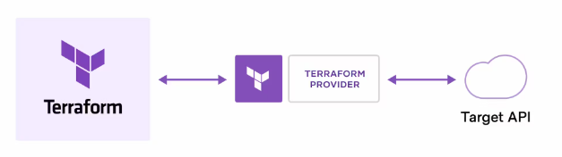

# What is Terraform

>  Terraform, a powerful Infrastructure as Code (IaC) tool

Terraform is an open-source tool developed by HashiCorp, designed to define and provision infrastructure through configuration files. Unlike traditional manual operations, Terraform allows us to describe infrastructure in a declarative manner and automatically create, update, or destroy resources through its Execution Plan.

One of the key advantages of Terraform is its cross-platform compatibility. In addition to supporting AWS, Terraform is also compatible with many other cloud platforms such as Google Cloud, Azure, and private cloud environments. This allows us to manage infrastructure across different platforms using a unified tool and language, greatly enhancing efficiency and consistency.

Terraform uses its own language, the HashiCorp Configuration Language (HCL), to define infrastructure. The HCL syntax is concise and easy to understand, allowing us to modularize and reuse resources, making configuration files more maintainable and scalable.

Overall, Terraform is a powerful and flexible tool that helps us effectively manage and automate the lifecycle of cloud infrastructure, especially in complex and dynamic environments like AWS. 

# Difference of Ansible and Terraform

In the realm of cloud computing and infrastructure management, both Ansible and Terraform are widely used tools, but they are designed with different goals and use cases in mind. Here's a detailed comparison between the two.

**1. Primary Use and Design Philosophy:**

- **Terraform:** Terraform is an Infrastructure as Code (IaC) tool primarily used to define and manage the lifecycle of cloud resources. It uses a declarative configuration approach, allowing users to describe the desired final state, and Terraform automatically generates an execution plan to create, update, or destroy resources. Terraform focuses on "infrastructure orchestration," meaning it is used to create and manage cloud resources like virtual machines, networks, databases, etc.
- **Ansible:** Ansible is primarily a configuration management tool used to manage and configure existing infrastructure. It also uses a declarative language but focuses on the "configuration state," ensuring that the target system reaches the user-defined state. Ansible is better suited for handling tasks such as server configuration, software installation, and service management, and it can automate operations on existing infrastructure.

**2. State Management:**

- **Terraform:** Terraform uses a "State File" to track and manage the state of the infrastructure. This state file records all resources in the current infrastructure and compares them with the actual environment during each execution plan to determine which resources need to be updated or deleted. The state file is critical to Terraform's operations as it ensures the accuracy and consistency of the infrastructure.
- **Ansible:** Ansible does not have a built-in state management system. Each time an Ansible playbook is run, it re-applies the specified state based on the current configuration. Therefore, Ansible is more suitable for tasks that do not require long-term state management or environments where configurations change frequently.

**3. Orchestration vs. Automation:**

- **Terraform:** Terraform specializes in infrastructure orchestration, meaning it can create, update, and delete cloud resources and manage resources across multiple cloud platforms. Terraform's strength lies in its ability to manage the entire lifecycle of infrastructure, building resources from scratch and maintaining consistency in their state.
- **Ansible:** Ansible focuses more on configuration management and automation, particularly on configuring existing resources. It is often used for tasks like software installation, updating configuration files, and deploying applications. Ansible's modular design makes it very flexible, capable of running on any operating system, and integrating with a wide range of third-party tools.

**4. Reproducibility and Portability:**

- **Terraform:** Terraform's declarative configuration files and state management provide strong reproducibility. Users can create identical infrastructure in different environments using the same Terraform configuration files, making it highly useful in multi-cloud or hybrid cloud environments.
- **Ansible:** Ansible also has strong portability because it is not dependent on any specific infrastructure platform. However, due to its lack of built-in state management, Ansible's reproducibility largely depends on how users write and organize playbooks.

# How Does Terraform Work?

Terraform creates and manages resources on cloud platforms and other services through their application programming interfaces (APIs). Providers enable Terraform to work with virtually any platform or service with an accessible API.

The core Terraform workflow consists of three stages:

- **Write:** You define resources, which may be across multiple cloud providers and services. For example, you might create a configuration to deploy an application on virtual machines in a Virtual Private Cloud (VPC) network with security groups and a load balancer.
- **Plan:** Terraform creates an execution plan describing the infrastructure it will create, update, or destroy based on the existing infrastructure and your configuration.
- **Apply:** On approval, Terraform performs the proposed operations in the correct order, respecting any resource dependencies. For example, if you update the properties of a VPC and change the number of virtual machines in that VPC, Terraform will recreate the VPC before scaling the virtual machines.

