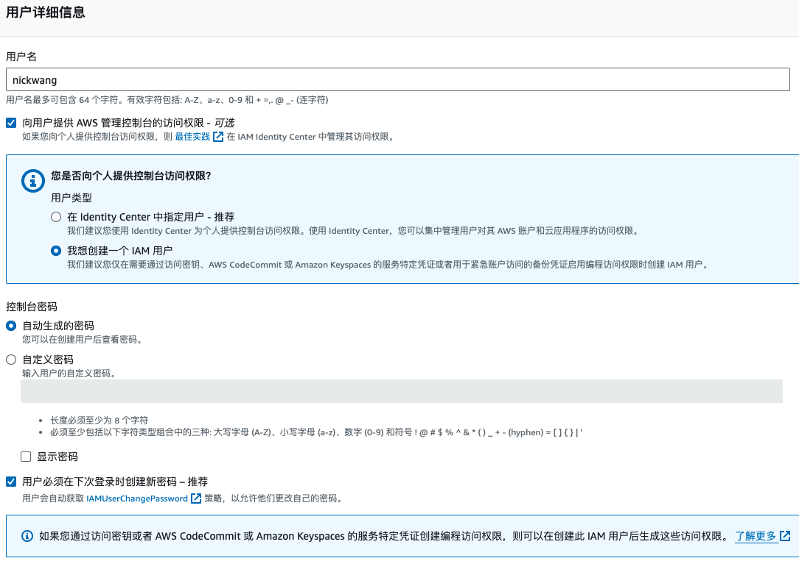
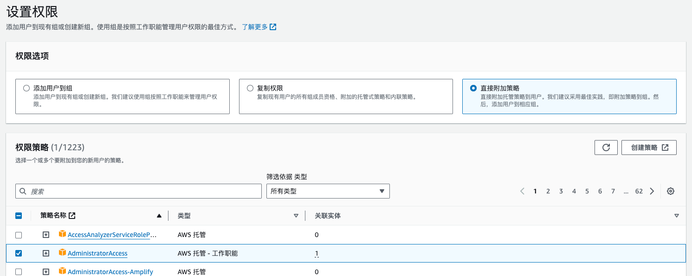
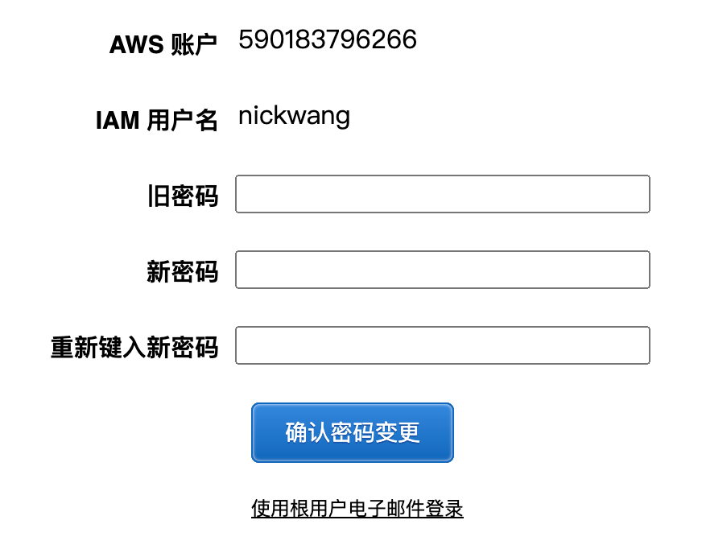
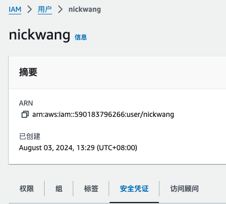
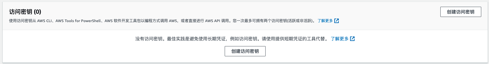
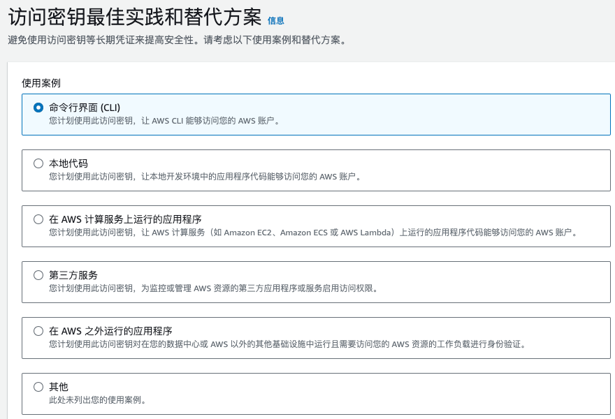

# Create an AWS account

> 1-year free tier for some services

# Identity and Access Management (IAM)

- ROOT user is create by default
- ROOT user has unlimited privileges

> So the first thing we want to do when the account is registered is create an admin user that has less privileges then the root user, but it will have all the privileges that we need to create.

## Create an Admin User via IAM

- Step 1: Add User

- Step 2: Set Permissions

After done, you will see the detail of login info

When you login at the 1st time, you will be required to reset the password.

## Add Access Key for User

Access this path:

Then click create access key:

After that, it will give you the access_key and related secret_key:

