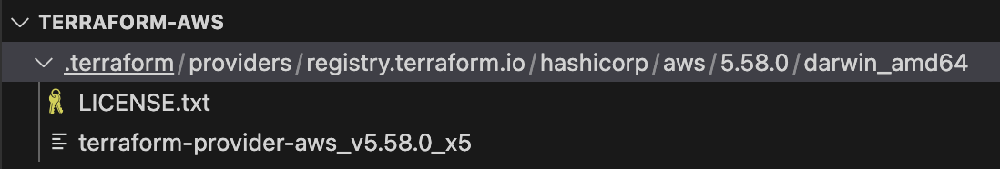

# Prociders

The first thing we need to do is connect to our AWS account, and in terraform, whenever you want to connect to a technology and start using its API to create resources inside, to configure it, to add some stuff, etc., the first thing you need is a provider.

Provider in terraform is basically a program or code that knows how to talk to that specific technology.

[Browse Providers](https://registry.terraform.io/browse/providers)

# Install Provider Locally

Edit the `main.tf` file, and specific the provider, then execute `terraform init`, then terraform will download the related provider locally.

```tf
provider "aws" {
  region = "ap-northeast-1"
  access_key = "xxx"
  secret_key = "xxx"
}
```

```bash
➜  terraform-aws git:(master) ✗ terraform init

Initializing the backend...

Initializing provider plugins...
- Reusing previous version of hashicorp/aws from the dependency lock file
- Installing hashicorp/aws v5.58.0...
- Installed hashicorp/aws v5.58.0 (signed by HashiCorp)

Terraform has made some changes to the provider dependency selections recorded
in the .terraform.lock.hcl file. Review those changes and commit them to your
version control system if they represent changes you intended to make.

Terraform has been successfully initialized!

You may now begin working with Terraform. Try running "terraform plan" to see
any changes that are required for your infrastructure. All Terraform commands
should now work.

If you ever set or change modules or backend configuration for Terraform,
rerun this command to reinitialize your working directory. If you forget, other
commands will detect it and remind you to do so if necessary.
```

# Check the folder

Now, we heve two files that have been generated by terraform.

- .terraform



These file downloaded by terraform, and that will then be talking to AWS for us.

- .terraform.lock.hcl

This is a file that basically keeps track of which providers are installed locally.